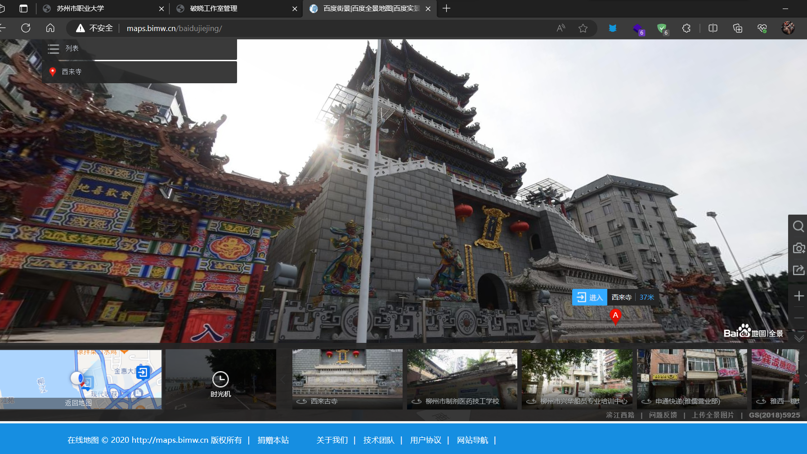
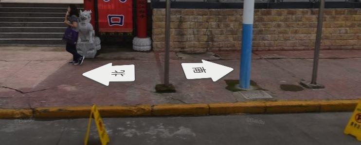
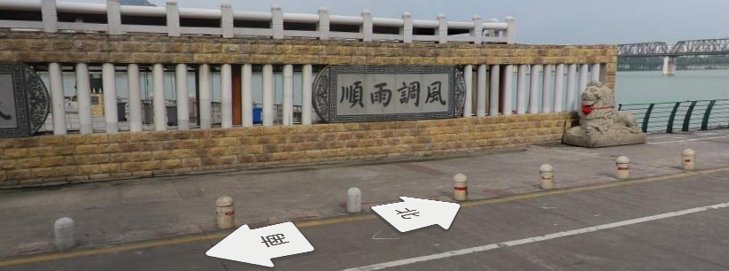

# Baby社工

- 作者：Wh1te_0range
- 参考：-
- 难度：Normal
- 分类：Misc
- 镜像：-
- 端口：-

## 题目描述

@ksks 学长的初中女同学带 @ksks 学长去旅游了，我们对此都很感兴趣，你能告诉我们他们去哪里了吗？flag提交格式为：`flag{景点名_拍摄的朝向_拍摄的时间_转身后最右侧的四个字}`

- 拍摄朝向：东/南/西/北
- 拍摄时间：上午/中午/下午
- 身后的字顺序按照从右往左。

例如：`flag{石湖_北_上午_石湖之韵}`

## 题目解析

百度识图还是个好东西

但是有时候吧，也不是那么的好用，具体你要往下看，找相似的图片，

找到相似图片后点进去，多次查找确认后，认定为西来寺

熟悉不？景点即为西来寺，拍摄的朝向根据全景地图判断为东

拍摄时间根据给出图片的电线杆朝向可以判断为下午，街景转身后可以看见右侧四字

本题结束！

______________________________________________________________________

题外话。

@13m0n4de：选手提交上来的 WP 中，有用社交媒体 APP 去识图，再查看这附近拍摄的视频的方法，这个思路也挺好。
