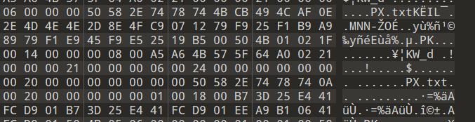
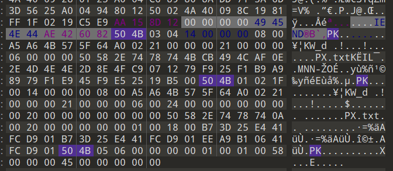
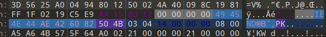

# 夜晚的星

- 作者：Wh1te_0range
- 参考：-
- 难度：Normal
- 分类：Misc

## 题目描述

也许在某个夜晚，闪亮的星划满天空，长长的**彗尾**带着人们的愿景飞向远方。

## 题目解析

打开附件得到如上图片，题目中已经给出隐晦提示，彗尾，一般出题人都是在提示文件尾部有东西，这种情况我们直接拖010查看即可

在这里我们发现一个PX的txt文件，仔细看后面还有pk，说明这是一个被zip包起来的文件，我们搜索504B0304，这是zip的文件头，其实都不用搜索了。

这边的IEND即是上面的png文件尾，我们将pk前的全部删了，另存为即可

