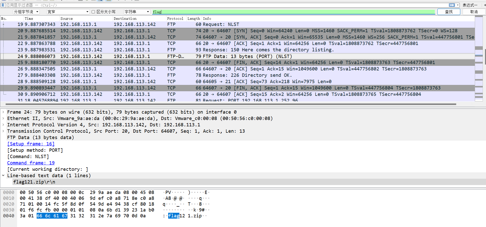
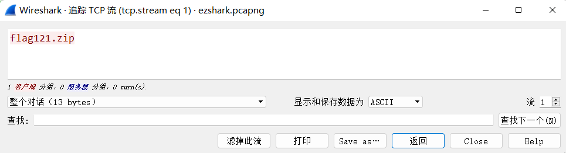
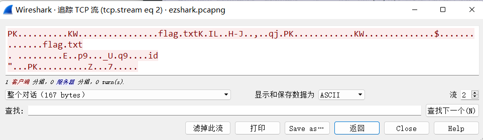
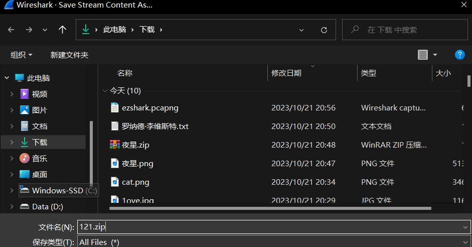
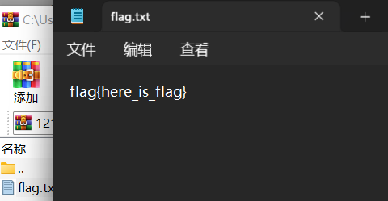

# SharkShark!芜湖！

- 作者：Wh1te_0range
- 参考：-
- 难度：Medium
- 分类：Misc

## 题目描述

我传了一个东西，你能把它找出来吗？

## 题目解析

题目给出一个流量包，这时候就需要wireshark这款软件了

流量题的一般基础解题思路是先搜索字符flag，看看是否有关于flag的内容

这边我们就直接查到了一个flag121.zip的包，我们追踪流看一下

右下角可以换流查看，前后翻一翻

pk开头，自然不用多说，我们点击显示和保存数据为，选择原始数据，随后save as...，文件名随意，后缀务必是zip

点开压缩包收获flag

