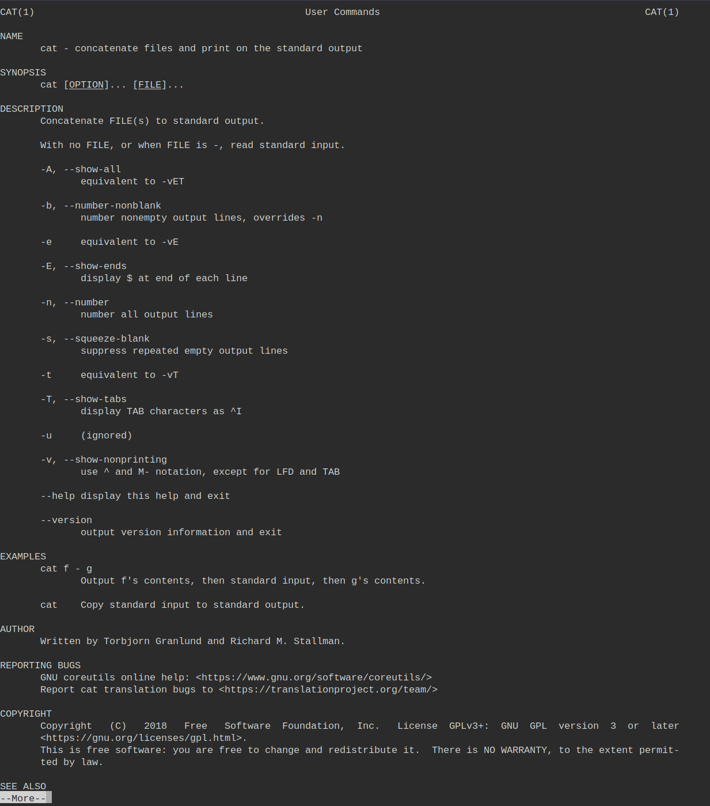

# 救命我被 Vim 困住了

- 作者：13m0n4de
- 参考：[TokyoWesterns CTF 4th 2018](https://ctftime.org/event/651)
- 难度：Medium
- 分类：PPC
- 镜像：-
- 端口：-

## 题目描述

*一阵声音响起，你惊醒了*

\*\*\*：「Hey, you. You're finally awake.」

你：「这里是什么地方啊啊啊」（派大星音）

\*\*\*：「忘记了？你来到这里冒险，被企鹅人的陷阱困住了，不过没关系，我已经解决了它们，快起来，你还有你要守护的东西。」

你：「可...可是...」

\*\*\*：「冒险者，何故如此犹豫？难道你已忘却了前行的道路，亲眼目睹那魔王的毁灭吗？难道你会坐视不理，见证村庄沦陷吗？那位智慧传承千秋的长者的忠告已然成风，如朝露般轻易消散吗？」

\*\*\*：「在这壮丽的传奇中，每一步皆是一项壮举，每一次挑战皆是一场考验。你岂敢以为这危险之旅仅是一段轻松的漫步？」

你：「可...可是...」

\*\*\*：「你真的领悟不到，每位冒险者的传说中，都曾有勇气战胜逆境的时刻吗？难道一点小小挫折会压垮你的意志，还是你会如传奇英雄一般勇往直前？」

\*\*\*：「当你的命运悬在一线，你怎能在此刻犹豫不决？你不渴望追寻伟大的召唤，争取胜利吗？」

\*\*\*：「快，快拿上这把最好的剑，去夺得 FLAG。」

你：「可...可是...你倒是告诉我怎么退出 Vim 啊！」

> Hint：此题是 Jail 类，由于平台限制，暂且归到 Misc 类里。~~本题所有输入均被用于绝对安全的随机数生成器中生成随机数种子~~

## 题目解析

用 vimrc 复刻的 [TokyoWesterns CTF 4th 2018](https://ctftime.org/event/651) 中 vimshell 这题。由于这个比赛没有开放源代码，我也不清楚它使用了什么方式限制用户输入，我这里用的是 `.vimrc` 配置文件，而 Web 终端使用的是 [ttyd](https://github.com/tsl0922/ttyd)。

### Vim 是啥

Vim 是从 vi 发展出来的一个文本编辑器。其代码补完、编译及错误跳转等方便编程的功能特别丰富，在程序员中被广泛使用。和 Emacs 并列成为类 Unix 系统用户最喜欢的编辑器。 

从 vi 派生出来的 Vim 具有多种模式，这种独特的设计容易使初学者产生混淆。

几乎所有的编辑器都会有**插入**和**执行命令**两种模式，并且大多数的编辑器使用了与 Vim 截然不同的方式：

- 命令目录（鼠标或者键盘驱动）
- 组合键（通常通过control键（CTRL）和alt键（ALT）组成）或者鼠标输入。

而 Vim，仅仅通过键盘来在这些模式之中切换。这就使得 Vim 可以不用进行菜单或者鼠标操作，并且最小化组合键的操作，大大增强速度和效率。

Vim 中有以下几种命令模式：

- 普通模式（Normal Mode）：\
    这是 Vim 的默认模式，用于导航和执行各种编辑操作。在普通模式下，你可以使用诸如移动光标、删除文本、复制粘贴等命令。你可以按下键入字符的方式进入其他模式。

- 插入模式（Insert Mode）：\
    插入模式用于输入文本。你可以通过按下 "i" 键（在光标前插入文本）或 "a" 键（在光标后插入文本）进入插入模式。在插入模式下，你可以像在常规文本编辑器中一样键入文本，直到按下 "Esc" 键返回到普通模式。

- 可视模式（Visual Mode）：\
    可视模式用于选择文本块，以便执行一些操作，例如复制、删除、或替换。你可以按下 "v" 键进入字符可视模式，或按下 "V" 进入行可视模式，也可以使用 "Ctrl-v" 进入块可视模式。

- 命令行模式（Command-Line Mode）：\
    在命令行模式下，你可以执行各种命令，例如保存文件、查找替换、设置选项等。你可以通过按下 ":" 键进入命令行模式。在这里，你可以键入不同的命令，然后按下 "Enter" 执行它们。

- 可视块模式（Visual Block Mode）：\
    这是一个扩展的可视模式，允许你选择矩形文本块。你可以按下 "Ctrl-v" 进入可视块模式，然后使用光标键来选择文本块。这在编辑多行文本或对齐文本非常有用。

- 插入可视模式（Insert Visual Mode）：\
    这个模式结合了插入模式和可视模式，允许你在可视选择的文本上插入文本。你可以按下 "Ctrl-i" 进入插入可视模式。

Vim 在这写模式间切换，倚靠的是大量快捷键，推荐查阅 Vim 手册：

- [Vim 中文手册](https://yianwillis.github.io/vimcdoc/doc/usr_toc.html)
- [Vim 中文帮助](https://yianwillis.github.io/vimcdoc/doc/help.html)
- [Vim Cheet Sheet](https://vim.rtorr.com/)
- [菜鸟教程](https://www.runoob.com/linux/linux-vim.html)

## 解题

这题的核心思路是进入命令行模式（或者之类的能执行命令的模式）。

进入命令行模式是为了能够执行 Vim 命令，可以保存文件、跳转文件、执行系统命令等等等等，几乎什么都可以做到。

正常情况下使用进入 Vim 的命令行模式是按下 `:` 键，但题目中把它映射为了空，还连带着映射了好几个字符：

```
noremap : <Nop>
noremap Q <Nop>
noremap g <Nop>
noremap ZZ <Nop>
noremap !! <Nop>
```

- 不能按下 `:` 进入命令行模式
- 不能按下 `Q` 进入 Ex 模式
- 不能按下 `g` 与其他键进行组合命令，比如 `gf` 跳转文件
- 不能按下 `ZZ` 保存并退出
- 不能按下 `!!` 执行外部命令

### 方法一：K 查看 Man 手册

如果你查阅了 Vim Cheet Sheet，你会发现可以按下 `K`（大写）进入光标所在单词的手册页面。

```
K - open man page for word under the cursor
```

如果存在这个单词的手册（man page），会打开一个编辑器来阅读它，在这个小小的编辑器中，可以输入 `!` 来执行外部命令（系统命令）

比如按下 `i` 进入插入模式，输入一个具有 man page 的工具名称，比如 `cat`：


按下 `ESC` 退出后，将光标放在 `cat` 上，按下 `Shift+k`（也就是大写的 `K`）：



此时按下 `!`，输入 `whoami`，即可执行 `whoami` 命令，得到返回 `root`：


输入 `!sh` 的话就会执行 `sh` 命令，获得一个交互式 Shell：


### 方法二：q: 进入命令历史页面

`q` 命令主要用于宏录制和宏执行，按下 `q:` 可以进入命令历史界面，在此界面中可以按下 `i` 插入想要执行的命令。


`ESC` 退出插入模式后，按下 Enter 回车键执行即可获得 Shell，同上：


### 方法三 插入模式 Ctrl + r 插入命令结果

在插入模式中，使用 `Ctrl+R` 后跟 `=` 可以执行表达式并将其结果插入到文本中。

比如 `<C+r>=system("cat /flag")`，输入 `Ctrl+r`，然后输入 `=system("cat /flag")` 即可把 `cat /flag` 的结果插入到文件中。


### 方法四：Ctrl + w 进入窗口管理模式

按下 `Ctrl+w` 后可以进入窗口管理模式，

但是大多浏览器 `Ctrl+w` 是关闭标签页，比较头疼，修改快捷键的方式也都太过 Hack。

可以尝试从命令行启动：

```shell
$ google-chrome-stable -app=http://IP:PORT/
```

这样打开的窗口输入 `Ctrl+w` 后不会关闭页面。

貌似 Edge `Ctrl+w` 是不会关闭页面的？没有试验过。

你可以先插入字符 `/flag`，退出插入模式，按下 `Ctrl+w` 再按下 `F`（大写），这样就可以打开一个新窗口显示 `/flag` 文件了：


又或者按下 `Ctrl+w` 然后输入 `:!sh` 直接获得 Shell。

### 方法五（非预期）：输入 ! 直接执行命令

这就尴尬了，不知道为什么我脑子一抽，Ban 掉的是 `!!` 而不是 `!`。

### 方法 N

除了这些解，肯定还有不少种方法能够读到 `/flag` 文件的。

有目的性的乱按，总会撞出来，这点 @pn1fg 摸鱼的时候测试过了，乱按得到 FLAG。

理应不该零解啊，挠头。