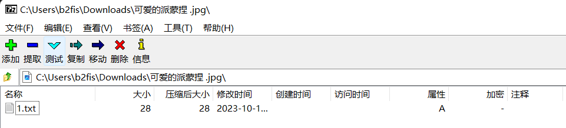
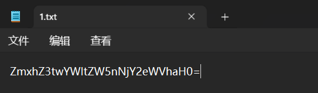
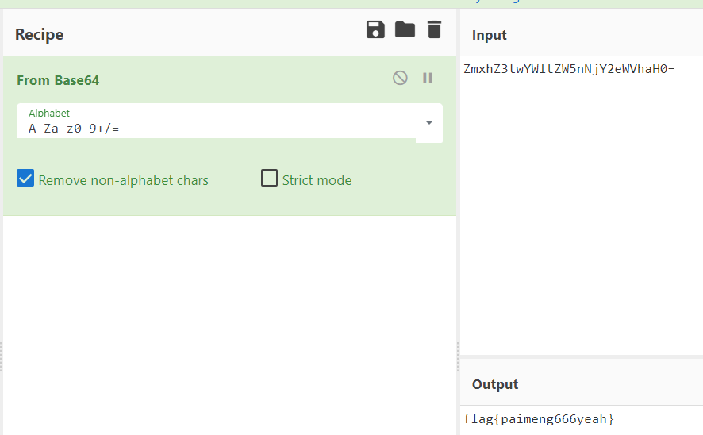
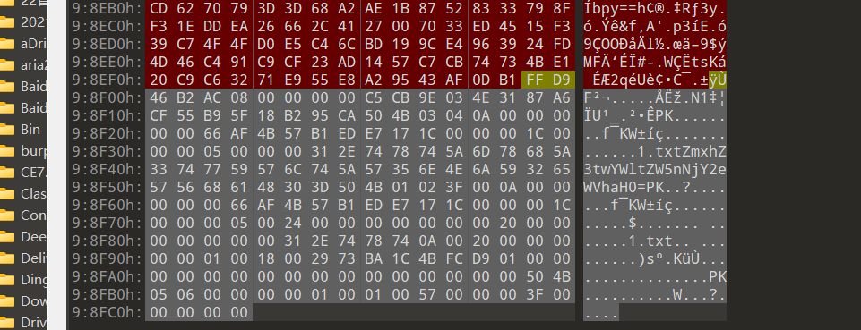

# 原神！重启！

- 作者：Wh1te_0range
- 参考：-
- 难度：Trivial
- 分类：Misc
- 镜像：-
- 端口：-

## 题目描述

我抓住了一只派蒙，**好像还附带了些什么**，大家快来看一看吧！择日，拍卖！

## 题目解析

本题，7z破坏了游戏平衡，下次我用7z包，这次用7z的便宜你们了

可恶的7z用户！！！

一眼鉴定为base64，解码即可

下面是无7z解题思路

根据题目提示可以说明图片附带了一些东西，我们010打开后发现尾部吊着一个zip文件，内涵1.txt

与夜晚的星处理一致，FFD9为jpg文件头，pk以前删除然后另存为，一套丝滑小连招。余下部分与7z后半处理方式一致。
