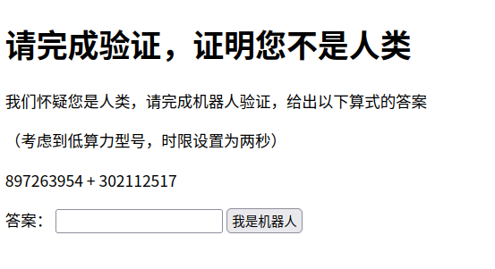

# 我们怀疑您是人类，请完成机器人验证

- 作者：13m0n4de
- 参考：-
- 难度：Easy
- 分类：PPC
- 镜像：-
- 端口：80

## 题目描述

## 题目解析

Web 偏向的 PPC。

考点：收发网络请求以及对网页内容进行解析。

网页提示需要在两秒钟之内计算一个加或减法算式：



更推荐使用**模拟发送请求**的方式，而不是**模拟浏览器**的方式，因为后者可能会更费时，并且代码也不够简便。

发送请求使用了 Python 中的 [requests](https://github.com/psf/requests) 库，解析网页使用了 [lxml](https://github.com/lxml/lxml) 库和 [XPath](https://www.w3schools.com/xml/xpath_intro.asp) 语法。

[solve.py](writeup/solve.py)

```python
import requests
from lxml import etree


url = "http://localhost"
session = requests.Session()

resp = session.get(url)
html = etree.HTML(resp.text)
expression = html.xpath("/html/body/p[@id='expression']/text()")[0]
print(expression)

answer = eval(expression)
resp = session.post(f"{url}/verify", data={"answer": answer})
print(resp.json())
```

`/html/body/p[@id='expression']/text()` 锁定了 id 为 `expression` 的标签内容，也就是页面显示的算式，接下来使用 `eval()` 计算表达式的值，最后 POST 传参过去。

注意要使用 `session`，因为服务器程序通过 Session 来保存客户端的正确答案以及开始时间，你需要保证两次请求是同一会话。

服务端代码在这：[main.py](build/app/main.py)

```python
from flask import Flask, render_template, request, jsonify, session
import random
import time
import os

app = Flask(__name__)
app.secret_key = os.urandom(24)
FLAG = os.getenv("GZCTF_FLAG")


@app.route("/")
def index():
    num1 = random.randint(10000000, 1000000000)
    num2 = random.randint(10000000, 1000000000)
    operator = random.choice(["+", "-"])
    expression = f"{num1} {operator} {num2}"

    if operator == "+":
        correct_answer = num1 + num2
    else:
        correct_answer = num1 - num2

    session["start_time"] = time.time()
    session["correct_answer"] = correct_answer

    return render_template("index.html", expression=expression)


@app.route("/verify", methods=["POST"])
def verify():
    user_answer = request.form["answer"]

    if time.time() - session["start_time"] > 2:
        return jsonify({"result": "Timeout"})
    if int(user_answer) != session["correct_answer"]:
        return jsonify({"result": "incorrect"})
    else:
        return jsonify({"result": "correct", "flag": FLAG})
```
