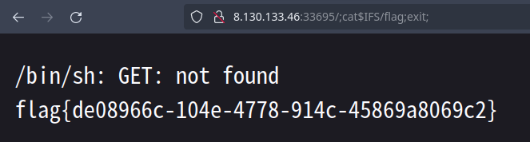

# 你会nc嘛？

- pn1fg
- 参考：-
- 难度：Baby
- 分类：Pwn
- 镜像：[svuctf-helloworld-2023/nc](https://ghcr.io/svuctf/svuctf-helloworld-2023/nc)
- 端口：70

# 题目描述

Netcat工具的使用

# 题目解析

本题考察Pwn方向的工具的使用，也是学Pwn的基础知识。

Netcat：

- 基本命令格式：nc \[ip address\] \[port\]

本题我们要做的就是 `nc ip port`

```shell
nc 8.130.133.46 33986
```

连接成功后，有无回显的话是要看出题人在远程服务器上的部署，本题就属于没有回显

我们连上后是类似于一个shell的终端，出题人在部署题目的时候，会给一些linux的基本命令，比如 `ls`、`cat`、`cd` 等，我们可以直接 `ls` 查看当前目录下的文件，

```shell
ls
bin
dev
flag
lib
lib32
lib64
```

本题就是如此，`ls` 就可以看到当前目录下有个 `flag` 文件

我们再用 `cat` 命令读取即可获得flag。

```shell
cat flag
flag{ecf047ff-3be8-4d80-a5a0-fe62524f492d}
```

______________________________________________________________________

@13m0n4de：鉴于许多同学喜欢用浏览器打开 Pwn 题，这里还真就提供提供一个用浏览器做 Pwn 题的方法：



起初是测试赛时的 `test_nc`，我们发现直接点开平台上的按钮在浏览器中打开 Pwn 题环境，居然可以直接返回 FLAG，应该是浏览器没有严格要求返回包的 HTTP 报文格式。

当时还以为是 Firefox-Nightly 的特性，但后来有选手说它们在 KALI 中自带的 Firefox 浏览器也可以，我们就去简单试验了一下，发现 Linux 上的 Firefox 和 Firefox-Nightly 都可以，而 Windows 里的 Firefox-Nightly 是不可以的。

Chrome 则是各平台都不可以、Chromium 也是。
