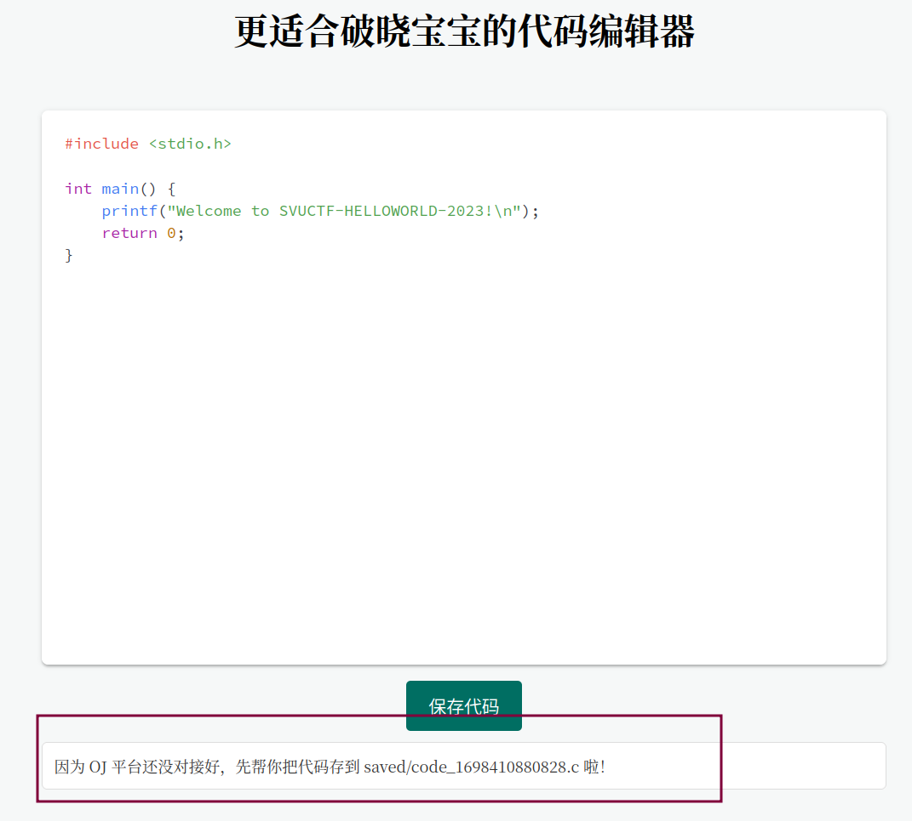
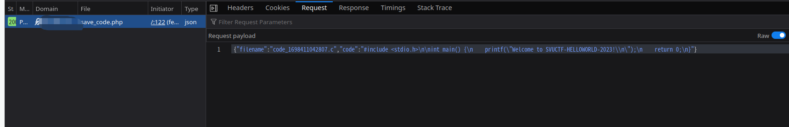
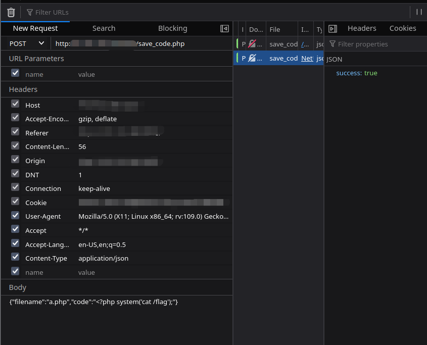

# 更适合破晓宝宝的代码编辑器

- 作者：13m0n4de
- 参考：-
- 难度：Easy
- 分类：Web
- 镜像：[svuctf-helloworld-2023/code_editor](https://ghcr.io/svuctf/svuctf-helloworld-2023/code_editor)
- 端口：80

## 题目描述

*某日*

@zzz：「你做的那什么鬼 OJ 平台，就一个破 API，连个页面都没有，咋用？」

@13m0n4de：「想要在线提交的页面？」

@zzz：「对。」

@13m0n4de：「最好再有个网页代码编辑器？」

@zzz：「对对。」

@13m0n4de：「那我懂了，用 ttyd 搭一个网页终端，让用户在里面使用 Vim 写代码，然后...」

@zzz：「打住...打住......这此比赛不能有再多的 Vim 出现了」

## 题目解析

其实是个普通的文件上传，只不过并不和常见的题目一样有选择文件点击上传的功能。

点击 `保存代码` 后，显示将文件存放在 `saved/code_xxxxx.c` 中：



访问 `https://IP:PORT/saved/code_xxxxx.c` 访问到此文件。

通过开发者工具中网络记录可以看到，上传请求是 JSON 格式，其中文件名 `filename` 和文件内容 `code` 都可控。



于是我们将 `filename` 修改为 `.php` 结尾的文件，内容修改为 PHP 代码，这样访问此文件的时候服务器就会将其作为 PHP 文件，解析我们输入的 PHP 代码。

```json
{
    "filename": "a.php",
    "code": "<?php system('cat /flag');"
}
```

我使用了开发者工具的重放功能，你们使用 BurpSuite 等都可以。



文件路径为 `saved/a.php`，访问 `http://IP:PORT/saved/a.php` 即可得到 FLAG 。