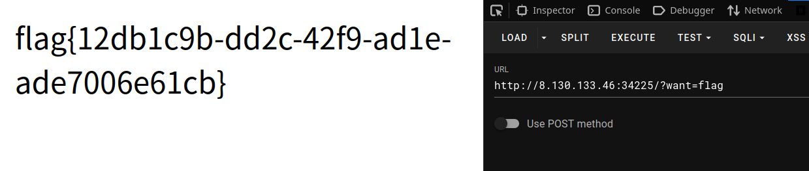
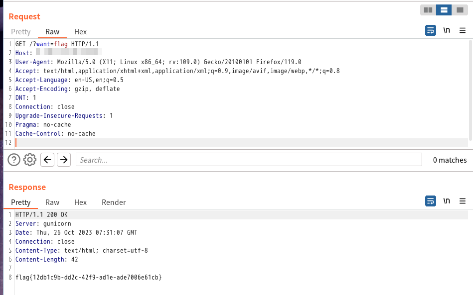

# GET

- 作者：ksks
- 参考：-
- 难度：Trivial
- 分类：Web
- 镜像：-
- 端口：80

## 题目描述

## 题目解析

页面提示：

> 请用 GET 方式提交一个名为 want，值为 flag 的变量

GET 请求格式参考：[菜鸟教程 - HTTP 方法：GET 对比 POST](https://www.runoob.com/tags/html-httpmethods.html)

### 浏览器

对于 GET 请求，在浏览器地址栏上修改 URL 就可以。

`http://ip:port/?want=flag`

### 浏览器插件

对于 GET 请求有点多余，但还是介绍一下使用 HackBar 插件，与在浏览器地址栏中修改一样。



### CURL

```shell
$ curl "http://8.130.133.46:34225/?want=flag"
flag{12db1c9b-dd2c-42f9-ad1e-ade7006e61cb}ag"
```

### BurpSuite

杀鸡用牛刀。


