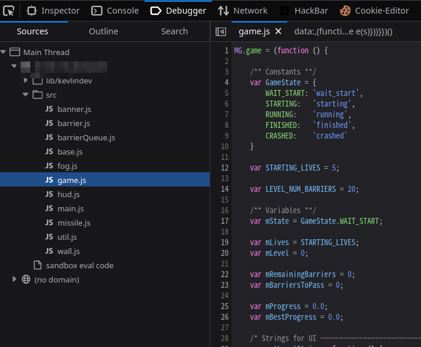

# 中场休息玩个游戏

- 作者：Only
- 参考：[LitCTF2023/Missile trail](https://github.com/ProbiusOfficial/LitCTF/tree/main/2023/Web/Missile%20trail)
- 难度：Easy
- 分类：Web
- 镜像：-
- 端口：80

## 题目描述

## 题目解析

题目照搬 [LitCTF2023/Missile trail](https://github.com/ProbiusOfficial/LitCTF/tree/main/2023/Web/Missile%20trail)，但是换成了动态 Flag 。

在开发者工具中查看网页源文件：



可以看到又许多 JavaScript 文件，对于做这些纯前端网页的 Web 游戏题，大概有两个目标方向：

1. 修改胜利条件或直接找到胜利后显示的内容
1. 修改玩家属性作弊

两者都需要对游戏逻辑有所了解，避免不了对 JS 代码进行分析，而分析需要明确方向才能高效。

游戏代码是通常有“主循环”这么一说的，我们可以从游戏的主循环开始分析，对游戏逻辑有个整体把握。

在 `main.js` 中找到了主循环：

```javascript
    var update = function (dt) {
        MG.fog.update(dt);
        MG.game.update(dt);
        MG.hud.update(dt);
        MG.banner.update(dt);


        MG.fog.updateDOM();
        MG.game.updateDOM();
        MG.hud.updateDOM();
        MG.banner.updateDOM();
    }

    var lastTick = 0;
    var zeroCounter = 0;
    var useFallback = false;

    if (!window.requestAnimationFrame) {
        useFallback = true;
    }

    var mainLoop = function(thisTick) {
        var dt;

        // Some browsers don't pass in a time.  If `thisTick` isn't set for
        //  more than a few frames fall back to `setTimeout`
        if (!thisTick) {
            zeroCounter += 1;
        } else {
            zeroCounter = 0;
        }
        if (zeroCounter > 10) {
            useFallback = true;
        }

        thisTick = thisTick || 0;
        if (useFallback) {
            dt = 1/30;
        } else {
            var dt = (thisTick - lastTick)/1000;
        }
        // pretend that the frame rate is actually higher if it drops below
        // 10fps in order to avoid wierdness
        if (dt > 1/10) {
            dt = 1/10;
        }

        lastTick = thisTick;

        update(dt);

        if (useFallback) {
            window.setTimeout(mainLoop, 1000 / 30);
        } else {
            window.requestAnimationFrame(mainLoop);
        }
    }

    mainLoop();
```

每次循环中会用 `update` 函数更新游戏内各个物体状态以及画面显示内容。我们继续跟进 `MG`，在 `game.js` 中找到了它。

```javascript
MG.game = (function () {

    /** Constants **/
    var GameState = {
        WAIT_START: 'wait_start',
        STARTING:   'starting',
        RUNNING:    'running',
        FINISHED:   'finished',
        CRASHED:    'crashed'
    }

    var STARTING_LIVES = 5;

    var LEVEL_NUM_BARRIERS = 20;

    /** Variables **/
    var mState = GameState.WAIT_START;

    var mLives = STARTING_LIVES;
    var mLevel = 0;

    var mRemainingBarriers = 0;
    var mBarriersToPass = 0;

    var mProgress = 0.0;
    var mBestProgress = 0.0;

    // ...
})
```

在其中定义了许多属性，比如游戏状态 `GameState`，我们发现有 `FINISEHD` 状态，代表了游戏完成，接下来找到游戏条件为 `FINISEHD` 时，会进行什么操作。

往下翻，找到了`MG.game.update` ，它在 `main.js` 的 `update` 中被调用过。

```javascript
update: function (dt) {
    MG.missile.update(dt);    
    MG.tunnelWall.update(dt);
    MG.barrierQueue.update(dt);    

    /* check whether the nearest barrier has been reached and whether the missile collides with it. */
    if (!MG.barrierQueue.isEmpty()) {
        if (MG.missile.getOffset() < MG.MISSILE_LENGTH && !MG.missile.isCrashed()){
            var barrier = MG.barrierQueue.nextBarrier();

            if (barrier.collides(MG.missile.getPosition().x, MG.missile.getPosition().y)) {
                // CRASH
                MG.missile.onCrash();
                goCrash();
            } else {

                // BARRIER PASSED
                MG.barrierQueue.popBarrier();
                MG.missile.onBarrierPassed();

                // TODO this block makes loads of assumptions about state
                if (mState === GameState.RUNNING
                    || mState === GameState.STARTING) {
                    switch(barrier.getType()) {
                        case MG.BarrierType.FINISH:
                        goFinish();
                        break;
                        case MG.BarrierType.BLANK:
                        break;
                        case MG.BarrierType.START:
                        mState = GameState.RUNNING;
                        // FALLTHROUGH
                        default:
                        mBarriersToPass--;

                        var startVelocity = getLevelStartVelocity(mLevel);
                        var finishVelocity = getLevelFinishVelocity(mLevel);

                        MG.missile.setVelocity(startVelocity
                                                    + (startVelocity - finishVelocity)
                                                    * (mBarriersToPass - LEVEL_NUM_BARRIERS)
                                                        / LEVEL_NUM_BARRIERS);
                        break;
                    }
                }
            }
        }    
    }

    while (MG.barrierQueue.numBarriers() < MG.LINE_OF_SIGHT/MG.BARRIER_SPACING) {
        var type = MG.BarrierType.BLANK;

        if (mState === GameState.RUNNING
            || mState === GameState.STARTING) {
            mRemainingBarriers--;
            if (mRemainingBarriers > 0) {
                type = MG.BarrierType.RANDOM;
            } else if (mRemainingBarriers === 0) {
                type = MG.BarrierType.FINISH;
            } else {
                type = MG.BarrierType.BLANK;
            }
        }

        MG.barrierQueue.pushBarrier(type);
    }
}
```

先是一个很长的 `if`，进行了墙面的碰撞判断，如果没撞上去再判断“障碍状态”，如果是 `MG.BarrierType.FINISH` 状态的话就调用 `goFinish()` 函数。

障碍状态在下面的 `while` 循环中更新，如果剩余障碍为零的话，就改为完成 `MG.BarrierType.FINISH` 。

`goFinish()` 如下：

```javascript
var goFinish = function () {
    MG.banner.show(Messages.FINISH.title(), Messages.FINISH.text());
    MG.util.showMouse();

    MG.missile.setAutopilot();
    MG.missile.setVelocity(getPostLevelIdleVelocity(mLevel));

    mState = GameState.FINISHED;
}
```

会在 Banner 上显示一行字，内容是 `Messages.FINISH.text()`。

继续查找 `Messages`：

```javascript
var Messages = {
    START: {
        title: getLevelString,
        text:  function () {return 'CLICK TO BEGIN';}
    },
    CRASH: {
        title: function () {return 'CRASHED';},
        text:  function () {return 'CLICK TO RETRY';}
    },
    GAME_OVER: {
        title: function () {return 'GAME OVER';},
        text:  function () {return 'CLICK TO START AGAIN';}
    },
    FINISH: {
        title: function () {return 'LEVEL COMPLETED';},
        text:  function () {if (mLevel === 6) {return '}b6ddb042311a-5e89-cb94-d654-bd3ccdbe{galf'.split('').reverse().join("");} else {return 'CLICK TO CONTINUE';},
    }
};
```

如果在第六关的话，输出 `'}b6ddb042311a-5e89-cb94-d654-bd3ccdbe{galf'.split('').reverse().join("")`。

这里是将 FLAG 反向存放，为了防止在源码中搜索 `flag` 直接能得到答案，输出的时候再倒过来一次，这样显示的时候就是正向了

______________________________________________________________________

当然这题没那么复杂，多点几下就可以肉眼分辨出 Flag 了，甚至玩游戏过了第六关也能给。

只是给大家一个 Web 游戏分析的示例流程。
