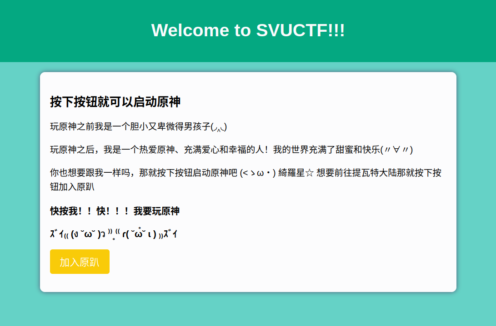
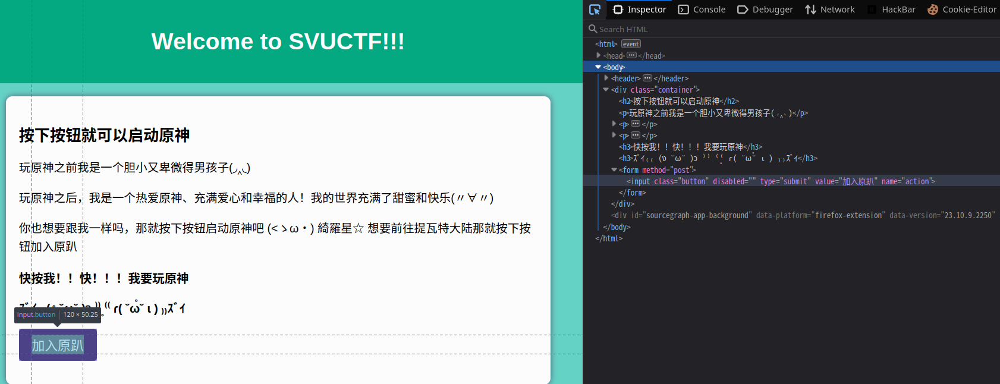
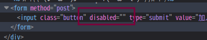
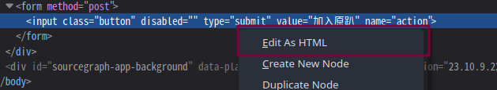
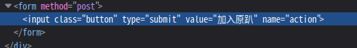
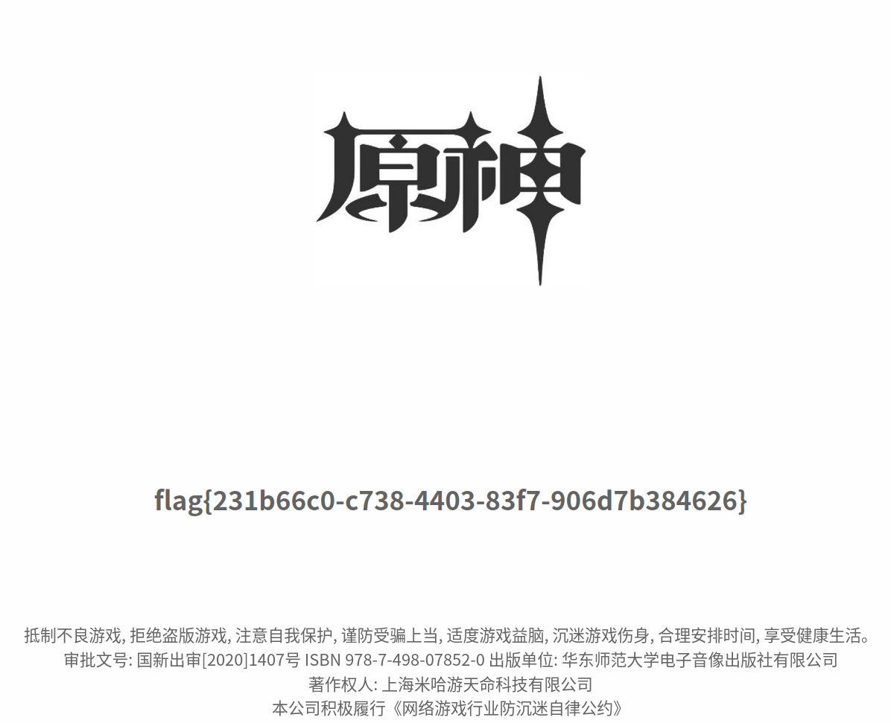

# 原神，启动！

- 作者：ksks
- 参考：-
- 难度：Easy
- 分类：Web
- 镜像：-
- 端口：70

## 题目描述

## 题目解析

考点是前端代码修改，这题打开来是这么一个界面，点击按钮就给 flag ，但是按钮按不下去。

打开浏览器开发者工具，审查元素，选中按钮：

发现它带有 `disabled` 属性：

HTML 中的 `disabled` 属性用来指示该元素是否应该禁用或不可用，你可以把 disabled 属性设置为 "false" 或删除它，这样按钮就会重新生效。

右键开发者工具中的 HTML 元素，选中修改 HTML，把 `disabled=""` 删除后点击编辑框外的区域即可保存。（不要刷新页面！）

然后点击按钮好啦。

flag 不方便复制的话，可以查看网页源码找到。
